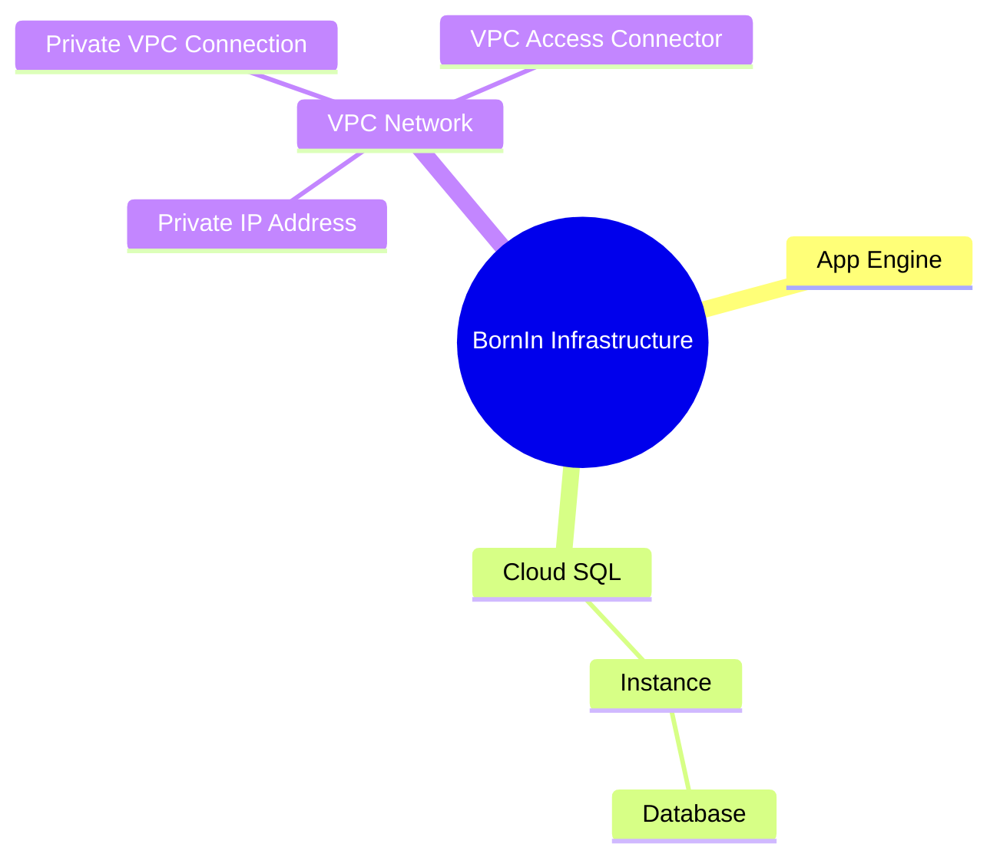

# Terraform Configuration for BornIn Application

This repository maintains the GCP infrastructure configration through utilising Github Actions and Terraform Cloud. 

```mermaid
mindmap
    root((BornIn Infrastructure))
        App Engine
        Cloud SQL
            Instance
                Database
        VPC Network
            Private IP Address
            Private VPC Connection
            VPC Access Connector

```