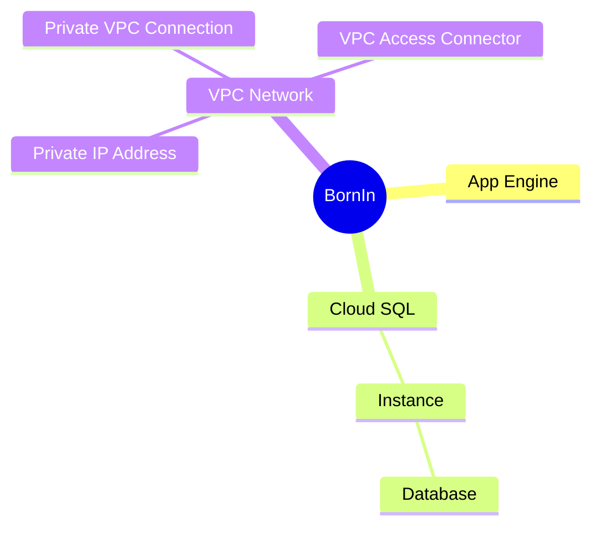

# Terraform Configuration for BornIn Application

This repository maintains the GCP infrastructure configration through utilising Github Actions and Terraform Cloud. 

Talk about
access to app engine endpoints - should be secured with IAP
cloud sql should be secured in a vpc network, closed off

app engine warm up inbound services
rollback
url testing 
logging and tracing

![Diagram](docs/Screenshot 2023-05-11 at 16.44.03.png