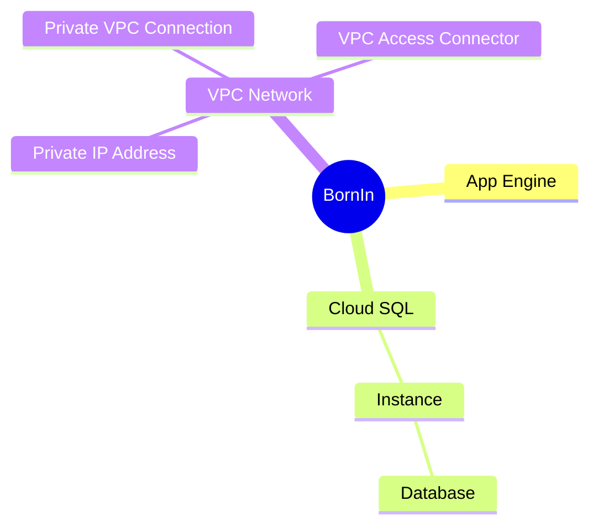
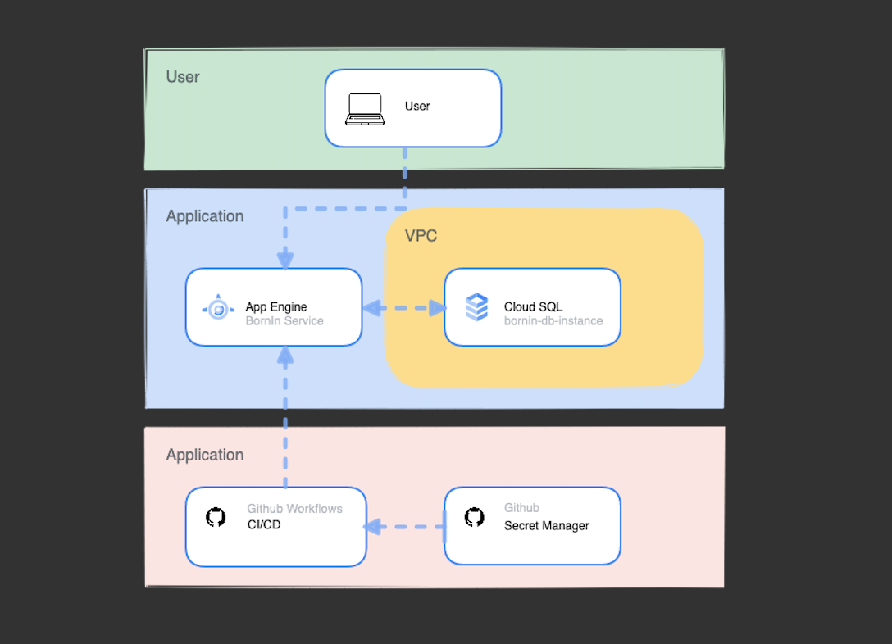
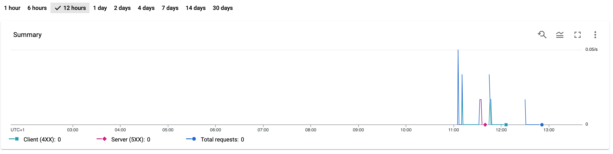
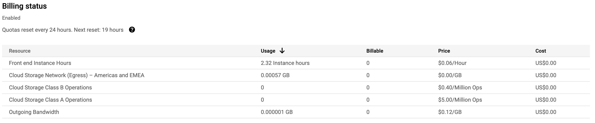
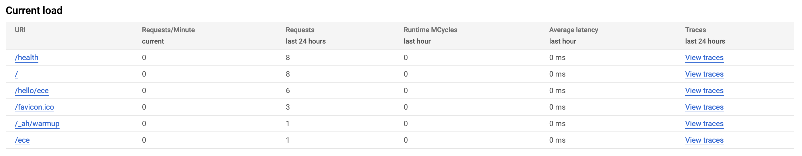
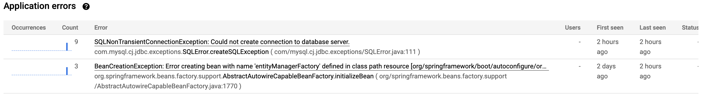
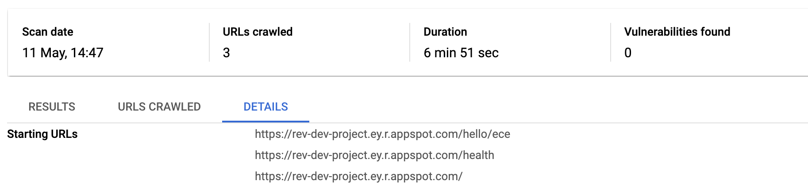
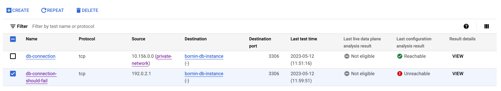
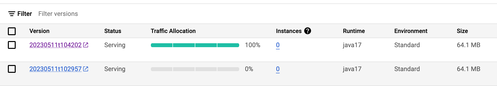

# Terraform Configuration for BornIn Application

This repository maintains the GCP infrastructure configration through utilising Github Actions and Terraform Cloud. 

# Architecture Diagram

## Monitoring, Logging and Tracing
Google App Engine has various built-in tools for visualising and analysing the metrics of your application.

### Network Traffic Monitoring
You can monitor the traffic of you application and responses

### Billing Monitoring
Keeping a close eye on billing is easy with the built-in billing status information on App Engine dashboard

### Tracing
You can trace the load on your URIs 

### Logging
Even see the errors that your application has encountered the most and trace them back to the application logs

## Security
##### App Engine
Enabling web security scans on your URIs allows you to scan them for vulnerabilities by testing them with many user inputs and event handlers

##### Cloud SQL
The Cloud SQL instance has a private IP and resides in a private VPC network. As the connection tests show below, only an IP from the private network can reach the Cloud SQL instance and the instance is unreachable otherwise.

## Scalability 
With App Engine, it's easy to scale deployments up and down, making it a great option for high-demand & no-downtime applications. When a new App Engine deployment is made, 
it is configured to use warmup requests in order to split the traffic between the new version and the previous version, improving the latency issues the user might face.

> If a new deployment is not running as expected, you can easily rollback to the the previous version via Google Cloud Console or migrate all the traffic to any version you like

## Further Improvements
* Access to App Engine URIs should be secured further by IAP to manage user access

