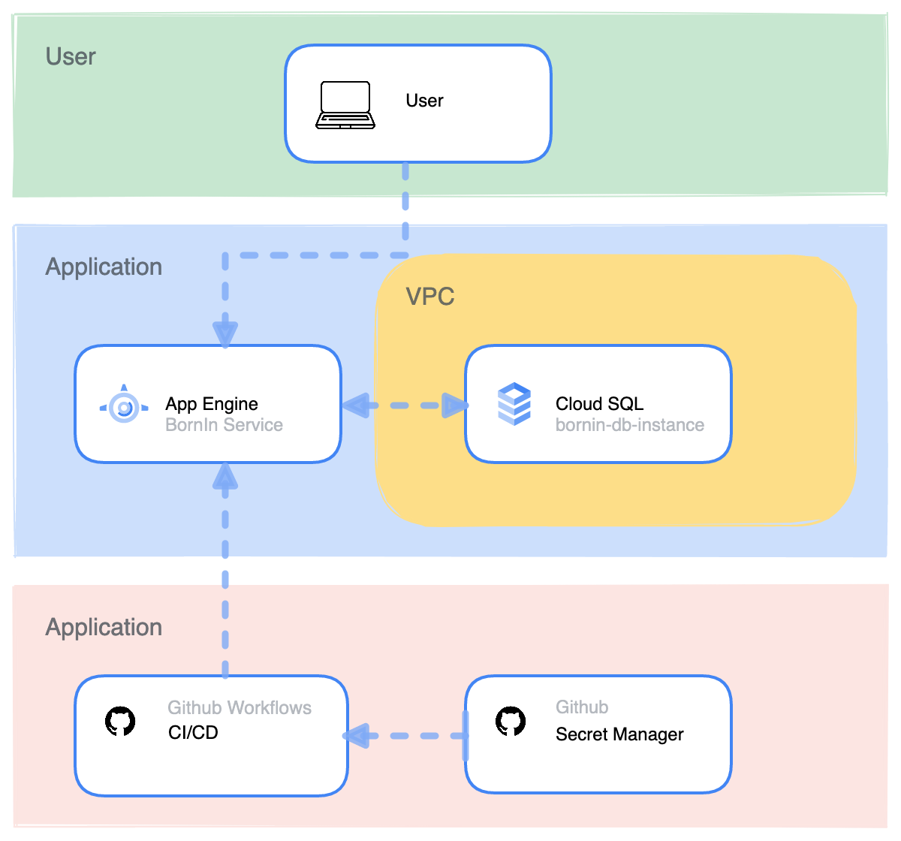

# Terraform Configuration for BornIn Application

This repository maintains the GCP infrastructure configration through utilising Github Actions and Terraform Cloud. 

# Architecture Diagram

## Monitoring, Logging and Tracing
Google App Engine has various built-in tools for visualising and analysing the metrics of your application.

### Network Traffic Monitoring
You can monitor the traffic of you application and responses

### Billing Monitoring
Keeping a close eye on billing is easy with the built-in billing status information on App Engine dashboard

### Tracing
You can trace the load on your URIs 

### Logging
Even see the errors that your application has encountered the most and trace them back to the application logs

## Security
Enabling web securty scans on your URIs allows you scan them for vulnerabilities by testing them with many user inputs and event handlers

> The Cloud SQL instance has a private IP and resides in a private VPC network

## Scalability 
With App Engine it's easy to scale applications up and down, making it a great option for high-demand & no-downtime applications. When a new App Engine deployment is made, 

app engine warm up inbound services
rollback - migrate traffic

## Further Improvements
access to app engine endpoints - should be secured with IAP

